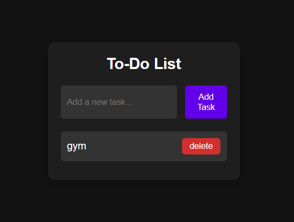

<h1 align="center">📝 To-Do List App</h1>

<p align="center">
  A simple and elegant To-Do List App built with HTML, CSS, and JavaScript that stores your tasks in <strong>LocalStorage</strong> so they're never lost on refresh!
</p>

<p align="center">
  
</p>

---

## 🚀 Features

- ✅ Add new tasks
- ❌ Delete tasks
- 🕒 Persistent storage using LocalStorage
- ✨ Stylish and responsive UI
- 🗂️ Auto-clear input after task added

---

## 🛠️ Tech Stack

- **HTML5** – structure
- **CSS3** – styling
- **JavaScript** – functionality
  
---


## 🧪 How to Use
1. Clone the repository  
   ```bash
   git clone https://github.com/anuj-singal/todo-list.git
   cd todo-list

2. Open index.html in your browser
3. Add, view, and delete your tasks!
   
---

## 👨‍💻 Author

<div> <a href="https://github.com/anuj-singal" target="_blank">  </a> </div>
Made with ❤️ by Anuj Singal

---

## 📄 License

This project is licensed under the MIT License.


